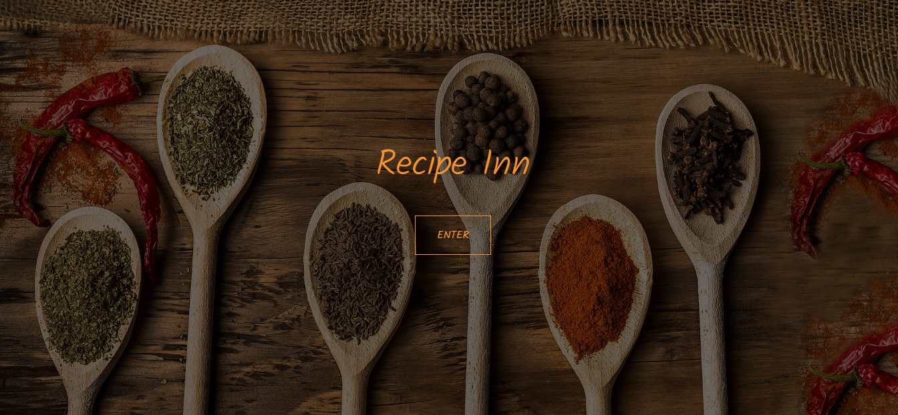
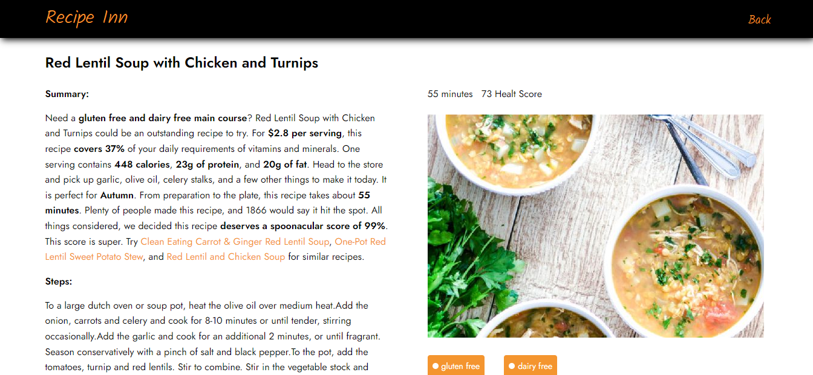
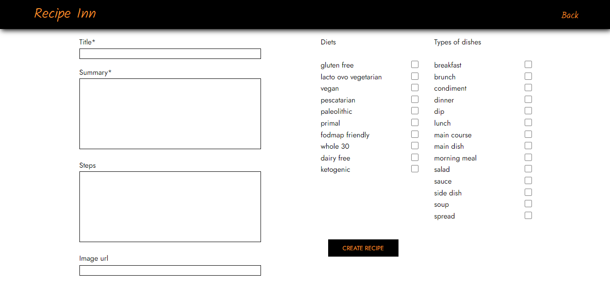

<h1 align="center">
  Recipe Inn
</h1>

Aplicación web creada con React, que permite buscar recetas. La aplicación consume una API creada con NodeJS, utilizando Express, que consume la API de Spoonacular y recetas propias creadas, guardadas en una base de datos Postgres. [Recipe Inn](https://recipe-inn.vercel.app/){:target="_blank" rel="noopener"}

## Como usar

- Clonar el repositorio: `git clone https://github.com/luiz-22/pi-food.git`
- En la carpeta api: `npm i`
- En la carpeta client: `npm i`
- Base de datos Postgres: instalar Postgres y guardar la variables de entorno en un archivo .env

## Tecnologías usadas

- React
- Redux
- Express
- Sequelize - Postgres