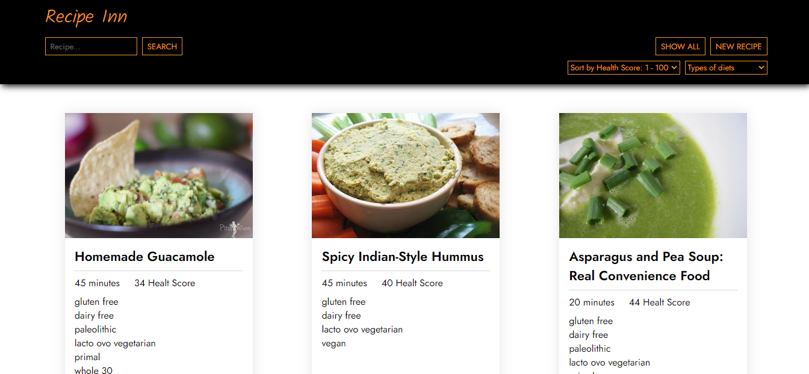

<h1 align="center">
  Recipe Inn
</h1>

Aplicación web creada con React, que permite buscar recetas. La aplicación consume una API creada con NodeJS, utilizando Express, que consume la API de Spoonacular y recetas propias creadas guardadas en una base de datos Postgres.

